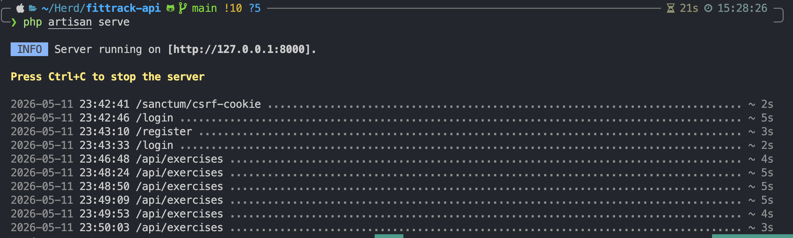
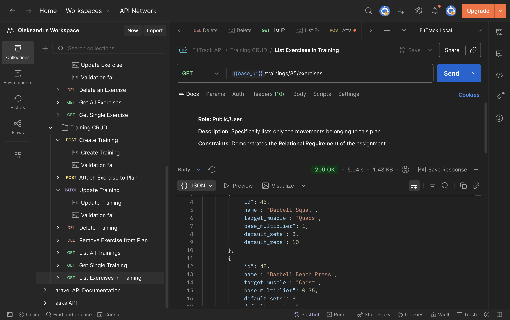
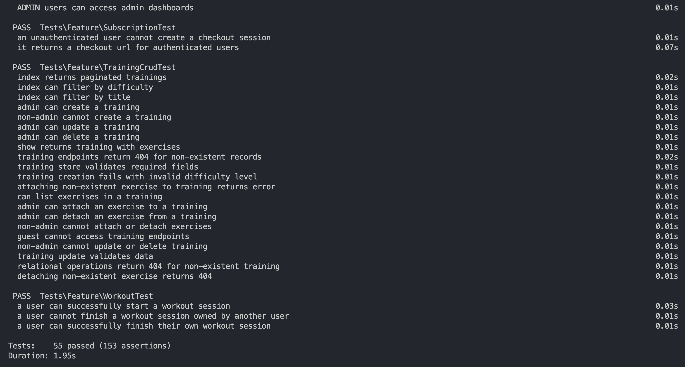

# 🚀 FitTrack API: Distributed Systems Final Project

**Project Option:** Option 2. REST API Service for a Complex Domain

**Language:** PHP (Laravel) — _Approved Alternative to Java 21+_

---

## 📖 Problem Description

The **FitTrack API** is a distributed backend service designed to manage a complex fitness ecosystem. It solves the problem of organizing workout curricula by modeling the relationship between **Trainings** (workout plans) and **Exercises** (individual movements).

The system provides a robust administrative interface for managing a global library of movements while allowing users to browse, filter, and view structured workout sessions. It handles complex data interactions, including many-to-many relationships, muscle-group analytics, and secure administrative oversight.

---

## 🛠 Technologies Used

- **Language:** PHP 8.2+
- **Framework:** Laravel 11.x (RESTful Framework)
- **Build Tool/Dependency Manager:** Composer
- **Database:** PostgreSQL (Production: Neon / Local: SQLite)
- **Caching/Session Store:** Redis (Upstash)
- **Testing:** Pest PHP (Unit & Feature Testing)
- **Authentication:** Laravel Sanctum (Stateful SPA Auth)
- **Infrastructure:** AWS Lambda (via Bref), Amplify, Route 53

---

## 🏗 Design Notes & Architecture

### Architecture Overview

The project follows a **Service-Oriented Architecture (SOA)**. This design separates the transport layer (Controllers) from the business logic layer (Services), ensuring the application remains maintainable and testable.

- **Controllers:** Handle HTTP requests and return JSON via Eloquent API Resources.
- **Services:** Contain the core business logic (e.g., calculations, database persistence).
- **Resources:** Manage data serialization to ensure consistent JSON structures.

### Key Components

1. **Training Management:** Full CRUD for workout plans with difficulty-level Enums.
2. **Exercise Library:** A centralized repository of movements categorized by target muscle groups.
3. **Relationship Sync:** A pivot-based system to dynamically attach/detach exercises to training plans with custom metadata (sets, reps).

### Important Design Decisions

- **Stateful Auth:** Used Laravel Sanctum with CSRF protection to simulate secure distributed communication between a decoupled frontend and backend.
- **Stateless Sessions:** Sessions are stored in Redis to allow the application to scale horizontally in a serverless (AWS Lambda) environment.
- **Validation:** Utilized `FormRequest` classes to ensure that no malformed data enters the system logic, returning standard `422 Unprocessable Content` errors.

### Limitations & Improvements

- **Current Limitation:** Authentication is cookie-based, requiring the frontend and backend to share a TLD.
- **Improvement:** Implementing WebSockets (Laravel Reverb) for real-time workout session tracking between multiple clients.

---

## 🚀 How to Build and Run

### 1. Initial Setup

```bash
git clone <your-repo-url>
cd fittrack-api
composer install

```

### 2. Environment Configuration

```bash
cp .env.example .env
php artisan key:generate

```

_Note: Update your `.env` with your database credentials (Postgres or SQLite)._

### 3. Database Migration & Seeding

This builds the complex domain schema and populates it with initial movements and plans.

```bash
php artisan migrate:fresh --seed

```

### 4. Start the Application

```bash
php artisan serve

```

The API will be available at **`http://localhost:8000`**.

---

## 🧪 How to Test

The project includes a comprehensive suite of **Unit** and **Feature** tests covering successful and unsuccessful scenarios.

### Run all tests:

```bash
php artisan test

```

### Coverage includes:

- **Positive:** Successful CRUD operations and relationship attachments.
- **Negative:** 401 (Unauthenticated), 403 (Unauthorized), 404 (Not Found), and 422 (Validation Error) scenarios.
- **Service Logic:** Direct testing of the `TrainingService` and `ExerciseService` classes.

---

## 📡 Example Usage (API Design)

### 1. Retrieve Trainings (Public)

`GET /api/trainings?difficulty=intermediate`

- **Response:** `200 OK` with paginated JSON list.

### 2. Create Exercise (Admin Only)

`POST /api/exercises`

```json
{
    "name": "Deadlift",
    "target_muscle": "Back",
    "base_multiplier": 1.2
}
```

- **Response:** `201 Created`

### 3. Attach Exercise to Plan (Admin Only)

`POST /api/trainings/{id}/exercises`

```json
{
    "exercise_id": 5,
    "default_sets": 3,
    "default_reps": 10
}
```

- **Response:** `200 OK`

---

## 📸 Evidence of Execution

1. **Server Running:** Screenshot of `php artisan serve` terminal.

    

2. **Client Interaction:** Postman screenshots showing GET/POST requests.

    

3. **Test Evidence:** Screenshot of `php artisan test` showing all green results.

    
